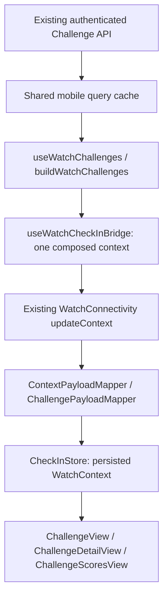

# Apple Watch Challenges — Milestone 4

## Release acceptance update — Milestone 8A

EAS/Xcode compiled and exported production-identity internal build 1005, including
the Watch app and Watch widget. All five Apple bundle versions, owned team and
App Groups were verified in the IPA. The maintainer confirmed physical iPhone
onboarding and Series 7 installation/first-run launch after provisioning recovery
and retries. Review identified the inherited weight-entry gate as an M8A blocker.
The revised source keeps first check-in on the normal Entry page, with navigation
to Challenges available without recording weight. Full EAS build 1006 and exported
identity/profile checks passed. The maintainer confirmed physical first-run display,
swiping to Challenges, its unsynced state and return to the usable Entry form without
entering or saving weight. M8A's navigation blocker is closed; an actual real-weight
Save/server acknowledgment remains pre-production QA. The earlier build 1005 does
not contain this fix.
Authenticated Challenge and complication behavior remain separate pre-production
QA. [RELEASE_VALIDATION.md](RELEASE_VALIDATION.md) is the current evidence;
the native limitations below describe the earlier milestones.

## Challenge polish extension — Milestone 7

[CHALLENGE_POLISH.md](CHALLENGE_POLISH.md) documents the implemented Rematch,
local notification and native widget/Tile/complication additions. These reuse
current score units, account guards and source freshness; watches remain read-only.
Earlier milestone scope statements below describe their original implementation.
Native compile/device acceptance remains open in [POLISH_VALIDATION.md](POLISH_VALIDATION.md).

## Workout Time extension — Milestone 6

[WORKOUT_CHALLENGES.md](WORKOUT_CHALLENGES.md) documents the implemented second
metric, canonical session qualification, contract versions, metric-aware clients
and companion snapshot v1/v2 transition. Steps behavior and privacy/transport
boundaries below remain intact. Native device acceptance remains outstanding.

The existing native watchOS companion now has a read-only **Challenges** page.
The iPhone projects the same server responses used by its Challenge screens into
the existing WatchConnectivity context. There is no Watch API client, credential,
HealthKit scoring, new ingestion pipeline, backend endpoint or database change.

## Integration base

Fork PR #4 merged normally into `main` at
`b333a116724e8c0899a8a036ae1a1ad29e4d2d42`. The subsequent upstream fetch still
resolved to `3c031663763fb5c6aedef7952b0163ef7cb5ef28`; no additional sync was needed.
That main was 31 commits ahead and zero behind the frozen upstream snapshot.
Work continues on `milestone/apple-watch-challenges`. All GitHub writes target the
fork; upstream's push URL remains disabled.

## Milestone 5 shared-code update

PR #5 is merged into fork main. Its Xcode/device/visual acceptance remains open.
Milestone 5 extracts platform-neutral projection/types/session state into
`companionChallenges`, `companionChallengeSession` and `useCompanionChallenges`.
The original Apple names below remain compatibility facades; Swift models,
protocol and the one composed context writer are unchanged. Wear uses the shared
projection through a separate Android Data Layer publisher, documented in
[WEAR_OS_CHALLENGES.md](WEAR_OS_CHALLENGES.md).

## Data flow and source map



Paths below are relative to `SparkyFitnessMobile/`:

| Layer                                     | Source                                                          |
| ----------------------------------------- | --------------------------------------------------------------- |
| Shared query definitions                  | `src/hooks/challengeQueryOptions.ts`                            |
| Headless cache observer and account guard | `src/hooks/useWatchChallenges.ts`                               |
| Bounded projection / wire types           | `src/utils/watchChallenges.ts`, `src/types/watchChallenges.ts`  |
| Auth transition barrier                   | `src/services/watchChallengeSession.ts`, `src/hooks/useAuth.ts` |
| Sole context composer                     | `src/hooks/useWatchCheckInBridge.ts`                            |
| Optional bridge field                     | `modules/watch-connectivity/index.ts`                           |
| Typed Watch models                        | `targets/watch/Domain/ChallengeModels.swift`                    |
| Wire parsing                              | `targets/watch/Adapters/ChallengePayloadMapper.swift`           |
| Views                                     | `targets/watch/Presentation/Challenge*.swift`                   |
| DEBUG fixtures                            | `targets/watch/Application/ScreenshotChallengeSeed.swift`       |

**`updateApplicationContext` is one latest-value slot for the entire app.**
The existing composer adds `challengeSnapshot` alongside nutrition, water,
check-in/history, acknowledgments, preferences and startable workouts. There is
still one TypeScript `updateContext` call site and one native
`updateApplicationContext` call site. A second Challenge publisher would overwrite
other pages. Check-in, water and workout commands keep their existing queued
transports and acknowledgment handling.

To let account clears publish without waiting for a server request, measurement
history now observes the existing range query cache rather than fetching inside
every context push. Requests/foreground refresh that same cache. Late pushes are
discarded by the existing generation guard and the new account revision guard.

## Versioned snapshot

`challengeSnapshot` is optional on the outer context for compatibility:

```text
version: 1
accountKey: local-server-config-id + authenticated profile id (no token or URL)
state: ready | unavailable
generatedAt: epoch milliseconds
items[]:
  id, name, lifecycle, membership
  startDate, endDate, timezone
  currentDay?, totalDays, daysRemaining
  participantCount?, calculatedAt?, leadMargin?
  rows[]:
    id, name, isSelf, total, rank?, tied, leader, gapToLeader?
    today?: { date, value, present, eligible }
    daysWithSteps, eligibleDays
hasMore: boolean
```

Values are property-list-safe primitives, arrays and dictionaries. Optional
values are omitted, not sent as null. There are no raw health records, full daily
history, emails or unrelated profile fields. Ranks, ties, leader identity, totals,
gaps, day progress and presence are copied from the server without recalculation.
Watch numeric totals use `Double`, avoiding 32-bit `Int` overflow on watchOS.

### Bounding and selection

- At most **eight** Challenges. Priority: pending invitations, active accepted,
  upcoming accepted, then at most **two** recent completed accepted Challenges.
- Within a priority, upcoming starts sort earliest first; other items sort by
  end date descending, with ID as a deterministic tie-breaker.
- Cancelled, declined and left memberships are omitted.
- Scored 1v1 includes both participants. Groups include server-ranked **top three
  plus self**, at most four rows, with original server ranks intact.
- Names are capped at 100 Unicode code points on the phone. The worst-case test
  fixture keeps the Challenge subdocument below 32 KiB; this is not a claim about
  the size of unrelated context fields or an OS transport limit.
- `hasMore` covers selection omissions and additional API pages. Selection uses
  **already loaded shared list pages**, initially 20 items. It does not crawl an
  unlimited history in the background. An older relevant item can remain outside
  that window until the user loads more on iPhone; the Watch says more are there.

Pending invitations never request a leaderboard and carry no scores or roster.
Accepted upcoming results supply participant count but their rows are omitted.
Results that no longer match the list's lifecycle/membership are withheld until
consistent data arrives. HTTP 403/404 removes that result; HTTP 401 clears the
entire Challenge snapshot, including when using API-key authentication.

## Account isolation

The account guard resolves the active local server configuration and authenticated
profile through the existing profile query. It verifies the configuration and
session revision again after asynchronous work. Challenge queries use the same
actor-scoped keys as the phone screens; existing auth switches clear the query
cache. No credential enters the Watch payload.

Auth changes synchronously block Challenge context **before** clearing queries
and awaiting cookie removal. Logout/session expiry remains blocked. An account
switch only unblocks after cookie clearing succeeds. The existing context composer
subscribes to that barrier even while the server is offline and sends an explicit
unavailable snapshot. A context started under an older revision cannot publish
after the switch. The final active-configuration check also rejects stale work.

Swift replaces optional Challenge data on every context; it never carries old
Challenge state forward when the field is absent or invalid. Navigation is keyed
by account, and an open detail resolves its ID from the current snapshot on every
update. A captured old navigation value cannot retain a departed account's data.

Delivery still requires the phone process and WatchConnectivity to run: an
unreachable Watch cannot be remotely erased instantly. The clear becomes the
latest queued context. A cold phone start without a verifiable authenticated
identity deliberately clears rather than assuming its persisted Watch belongs to
that account. This privacy boundary takes precedence over offline retention.

## Refresh, reconciliation and offline state

The phone and Watch observer share list/results options and actor query keys,
with a 30-second stale time. Fresh screen cache entries are reused. Normal phone
mutations and `refreshHealthSyncCache` invalidate Challenges; query changes
naturally rebuild the composed context. Foreground, reachability and Watch context
requests invalidate the active Challenge family, throttled to once per 30 seconds.
Failed initial profile checks can retry on those triggers. There is no polling,
remote Watch fetch or durable Challenge mutation queue.

Temporary network failures with a verified account retain its last successful
query data and the Watch's persisted context. Simply resending does not refresh
its timestamp: `generatedAt` is the oldest successful query timestamp contributing
to the snapshot. The Watch displays relative update age, and **May be out of date**
after 15 minutes. Its minute timer updates only that presentation.

Server results can change after completion, including a lower canonical step
correction. Updated context replaces the displayed result; neither client freezes
a winner. A server daily bucket is labelled Today only while that calendar date
is current in the Challenge timezone; otherwise the Watch shows its date. The
Watch does not advance lifecycle, rank or remaining days using its own clock.

## Page and presentation

`challenge` is appended to TypeScript `WATCH_PAGE_KEYS` and Swift `WatchPage`.
Existing saved orders append new keys normally. Settings → Apple Watch supports
reordering and hide/show, retains the final-visible-page rule and preserves the
active-workout page override. When weight is missing or stale, `WatchPage.initial`
selects Entry if visible, unless a workout is active. Entry renders First check-in
inside the same swipeable page deck; it never prevents navigation to Challenges
or other visible pages. Explicit swipes/deep links take precedence over the initial
selection, hidden Entry stays hidden, and returning to Entry without saving still
shows the form. Save retains the original real capture/queued delivery calls.

- One item without additional items opens directly into detail. Multiple items
  use native scrolling/navigation with compact summaries and a has-more hint.
- **1v1:** a large own total, opponent total, server rank/tie and lead/gap, today's
  values, date progress and time/status. Stacking accommodates larger text better
  than squeezing both totals into half a display.
- **Group:** original ranks, leader/tie labels, own-row highlight and participant
  count. Self at rank seven remains seven, even alongside only the top three.
- **Invitation:** safe name/dates/timezone/rules and Accept on iPhone; a closed
  invitation says Review on iPhone. No score before consent or Watch mutation.
- **Upcoming:** start date, rules and available participant count, without fake
  competition zeroes. **Completed:** current reconciled results and a correction
  note. Cancelled history is omitted.
- **Empty:** an iPhone creation hint. An absent/old/unknown-version context says
  Challenges not synced yet. Partially malformed rows are dropped by the adapter.
- Explicit zero is formatted as **0 steps**. Missing eligible data says **No step
  data**; coverage explains that absent days may not have synced. No sync-complete
  assertion is made.

SwiftUI uses native semantic fonts/styles, rounded numeric typography, SF Symbols,
scrolling and standard navigation. Rank/tie/lead uses text as well as color.
Participant/score groups have combined screen-reader labels; headers and stale
state have meaningful semantics. No new animation or haptic behavior is added.
Numbers and calendar labels use native locale formatting. Watch copy follows
upstream SwiftUI localized literals / `String(localized:)`; no new Watch language
catalog or translation pipeline is introduced. The phone settings label updates
only canonical English, with existing fallback for other languages.

## Validation and native acceptance

See the validation record below. Linux can check TypeScript, Jest source contracts
and generated Apple metadata; these do **not** prove Swift compilation, layout,
VoiceOver or paired-device behavior.

On a Mac with Xcode, run from `SparkyFitnessMobile/`:

```sh
bash scripts/test-watch-models.sh
APP_CONFIG_ONLY=1 EXPO_BUILD_NUMBER=100 pnpm build:profile sparkyrivals-development \
  pnpm exec expo prebuild --clean --platform ios --no-install
```

The first command compiles real models/adapters and runs 29 assertions, including
the exact JSON projection fixture also asserted in Jest. Then follow
[BUILDING.md](BUILDING.md) for unsigned simulator compilation and `pnpm watch`.
The existing manual `ios-build.yml` prepares the same model checks and simulator
screenshots. **Actions remains disabled; no workflow was dispatched.**

The existing DEBUG-only seed entry accepts:

```text
SPARKY_SCREENSHOT_SEED=1
SPARKY_SCREENSHOT_PAGE=challenge
SPARKY_SCREENSHOT_WORKOUT=none
SPARKY_SCREENSHOT_CHALLENGE=versus
```

Other states: `group`, `invitation`, `upcoming`, `completed`, `empty`, `multiple`,
`stale`, `tied`. The workflow prefixes launch variables with `SIMCTL_CHILD_` and
captures all nine. Both the seed and its caller are excluded from release builds.
Fixtures never enter production server data. Screenshots have not been generated
on this Linux host.

Before native acceptance, compile the full iPhone/Watch simulator targets, run the
model checks, inspect all seeds on small and large displays and with larger text,
and check VoiceOver. Then verify real paired context delivery, offline retention,
account clearing, mutation/health refresh and existing water/check-in/workout
flows. Credentials/device signing are separate owned-build setup, not created by
this milestone.

### Linux validation record — 2026-10-03

| Check                                                                           | Result                                                                                      |
| ------------------------------------------------------------------------------- | ------------------------------------------------------------------------------------------- |
| Mobile `pnpm run validate`                                                      | Pass: generation, TypeScript, lint, localization audit, Knip, native locales and formatting |
| Mobile `pnpm run test:ci --watchman=false`                                      | **494 suites / 7,642 tests passed**, no failed/skipped tests                                |
| Workflow safety / PR validation scripts                                         | **14 tests passed**                                                                         |
| Clean iOS prebuild and `validate:native`, owned development/preview/production  | All three pass in `APP_CONFIG_ONLY=1` with build number 100                                 |
| Repeat production clean prebuild / semantic metadata comparison                 | Pass; metadata hash `8b202894129983f403b985139ca3a51599d661beeaf9b0fcacf08d7554909d07`      |
| Docs production build                                                           | Pass, with existing large-chunk advisory                                                    |
| Changed fork docs formatting / local Markdown destinations                      | Pass; 44 local destinations exist                                                           |
| Shell syntax / `git diff --check`                                               | Pass                                                                                        |
| Swift model executable (29 checks), Xcode compile, simulator/screenshots/device | **Not run:** Linux has neither `swiftc` nor `xcodebuild`                                    |

The full mobile suite adds 53 tests over the merged Milestone 3 baseline. It covers
the bounded projection, zero/absence, ties, self outside the top three, lifecycle,
shared cache reuse/invalidation, transient errors, account switching/logout,
in-flight privacy clears, pairing and profile recovery, composed fields, page
settings, native source/wire contracts and DEBUG seeds. Existing build identity,
signing, links, health own-write dedupe and workout/telemetry tests also pass.
The 29 compiled Swift checks are prepared separately; Jest source contracts are
not counted as execution of those native checks.

Prebuild reports the expected missing Apple team warning; no account credential
was supplied. It generates a synchronized Watch source group including the new
tracked files. Expo dependency alignment was not changed. Existing React test
`act(...)` console warnings still appear in unrelated suites; no test failure was
suppressed. There were no backend/shared/web implementation changes requiring
database or web test reruns.

## Deliberate boundaries

No Watch accept/decline/create/invite/rename/leave/cancel transport exists. Those
remain iPhone actions; a future Watch write protocol needs durability, idempotency
and acknowledgments. Milestone 7 adds a Challenge complication through the existing shared-store
boundary without changing calorie/water data. See [CHALLENGE_POLISH.md](CHALLENGE_POLISH.md)
for implementation and outstanding Xcode/device acceptance.

No workout scoring, Wear OS, backend/RLS change, new account credentials, cloud
build, publication or deployment occurred. `SparkyFitnessSessionId` and existing
workout transports remain intact. Production storage policy remains the separate
server checkout's bind-mounted `dockerdata/`; no Docker changes are needed.

## Companion snapshot v3

M8A.6 adds metric/mode/unit-aware scores and an explicit lobby directing configuration and Ready to iPhone. v1/v2 stay supported. Account clearing, source staleness and the single composed publisher remain. See [CHALLENGE_TYPES.md](CHALLENGE_TYPES.md).
