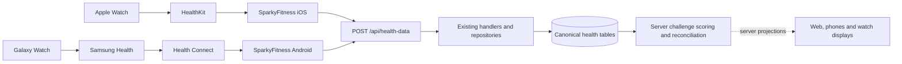

# Architecture audit and future Challenges design

## Workout Time extension — Milestone 6

[WORKOUT_CHALLENGES.md](WORKOUT_CHALLENGES.md) documents the implemented second
metric, canonical session qualification, contract versions, metric-aware clients
and companion snapshot v1/v2 transition. Steps behavior and privacy/transport
boundaries below remain intact. Native device acceptance remains outstanding.

Verified against upstream `f8df11ac3b019d022d3fa4a1b39c1b2f8576d361` on
2026-10-02. Challenge and Watch sections were updated through milestone 5 on 2026-10-03.
Other sections describing future work remain proposals.
Paths below are relative to the repository root.

## Workspace and server

The pnpm workspace contains the Express API, React web app, Expo mobile app,
source-first `@workspace/shared` TypeScript package, and VitePress site. The legacy
`frontend` workspace entry has no directory. `SparkyFitnessGarmin` is a separate
Python FastAPI service. Docker, Helm, Nix, and Umbrel deployment definitions remain
upstream infrastructure.

The installed baseline uses Express 5, Better Auth 1.7, PostgreSQL through `pg`,
Zod 4, TypeScript 6, and Vitest 5. React is overridden workspace-wide to 19.2.3.
Package manifests and the frozen install take precedence over older prose saying
React 18, JWT-only auth, TypeScript 5, or Vitest 4.

Server startup is `SparkyFitnessServer/index.ts`: load root `.env` and file secrets,
preflight, dynamically initialize the database, then import `SparkyFitnessServer.ts`.
Initialization holds a PostgreSQL advisory lock on one connection, applies sorted
SQL files in `db/migrations/`, tracks full filenames in
`system.schema_migrations`, grants the application role permissions, and reapplies
`db/rls_policies.sql`. This precedes Better Auth's eager schema check. There is no
separate fork migration framework. See `utils/initializeDatabase.ts` and
`utils/dbMigrations.ts`; the root SQL snapshot is CI-maintained, never a local edit.

APIs live under `/api`, with newer typed routes under `/api/v2`. Routes validate
and authorize, services orchestrate, and `models/` repositories issue parameterized
SQL. Shared database and API Zod schemas live in `shared/src/schemas/`; server
route schemas compose them. Swagger/ReDoc are under `/api/api-docs/`. Do not add
business logic to the central route registry.

`services/backgroundJobScheduler.ts` registers provider sync, backup, session,
ticket, and other jobs; `SPARKY_FITNESS_DISABLE_SCHEDULED_JOBS=true` disables them.
An optional Garmin Python service talks to Garmin Connect; the API orchestrates
and persists its results through `services/garmin/` and
`integrations/garminconnect/`.

Server tests use Vitest and Supertest in `SparkyFitnessServer/tests/`; database
integration suites use explicit test-database guards and real RLS/application
roles. Web tests use Jest/Testing Library under `SparkyFitnessFrontend/src`; mobile
uses Jest/React Native Testing Library and native-module mocks. Shared schemas
are exercised through consuming packages. Each package's `validate` script and CI
test command define the local check set. See [BASELINE.md](BASELINE.md) for exact
commands, results, and the observed database-suite concurrency limitation.

## Identity, authorization, and dates

`auth.ts` configures Better Auth sessions, API keys, password/email flows, MFA,
passkeys, and SSO/OIDC. Runtime identity is `public."user"`, with `session`,
`account`, `api_key`, `two_factor`, and related tables; `profiles` and
`user_preferences` contain application profile/settings. The generated
`Users.zod.ts` describing legacy `auth.users` is not the new-domain identity model.

`middleware/authMiddleware.ts` resolves cookie/session and API-key access, including
mobile session headers. `req.authenticatedUserId` is the actual actor;
`req.userId` is the active target and may differ during family delegation.
`checkPermissionMiddleware`, `onBehalfOfMiddleware`, and `permissionUtils.ts`
apply the existing diary/check-in/reports/medications/symptoms permissions.

`db/poolManager.ts:getClient(target, actor)` borrows the application-role
connection and sets `public.set_app_context`. The authenticated actor can also
come from request `AsyncLocalStorage`. Always release it in `finally`.
`getSystemClient()` uses the owner connection and bypasses ordinary RLS; it is
not a shortcut for participant-facing challenge reads.

Current RLS assigns check-ins, custom measurements, daily health metrics, and
health sample series to check-in policies; exercise entries and preset sessions
use diary policies. Telemetry child access follows its parent. Read the actual
`rls_policies.sql` and `docs/src/developer/database-security-tiers.md`; shorter
architecture examples contain stale tier descriptions. A competition invitation
must not grant access to another participant's diary or full health records.

PostgreSQL `DATE` is parsed as a calendar-day string, not a JavaScript UTC date.
Use `shared/src/utils/timezone.ts` and `utils/timezoneLoader.ts` for IANA-zone
boundaries and DST. Health ingestion prefers record IANA timezone, then recorded
UTC offset, then account timezone. An already bucketed `YYYY-MM-DD` is preserved.
Workouts use the start instant's day; sleep uses the wake day. Preserve
`record_timezone` and `record_utc_offset_minutes` where available.

## Canonical health storage

There is no single universal health-total table used identically by every provider.
Read the existing metric's canonical path instead of summing all representations.

| Metric                           | Existing persistence and flow                                                                                                                                                                                            | Important semantics                                                                                                                                                                                                                                     |
| -------------------------------- | ------------------------------------------------------------------------------------------------------------------------------------------------------------------------------------------------------------------------ | ------------------------------------------------------------------------------------------------------------------------------------------------------------------------------------------------------------------------------------------------------- |
| Daily steps                      | `check_in_measurements.steps`, unique `(user_id, entry_date)`; `healthDataHandlers.ts` maps `step`/`steps` to the check-in batch; `measurementRepository.bulkUpsertCheckInMeasurements` and `upsertStepData` persist it  | Automated writes use `GREATEST` against the stored total. Manual `upsertCheckInMeasurements` overwrites supplied fields and can lower/clear steps. No per-provider provenance column is retained here.                                                  |
| Additional provider step summary | `daily_health_metrics.total_steps` keyed by user/day/`source_provider` (e.g. Garmin and Polar)                                                                                                                           | Supplementary provider metrics, not a second amount to add to canonical steps. Workout `exercise_entries.steps` is already part of daily activity.                                                                                                      |
| Mobile daily distance            | `custom_measurements.value` joined to `custom_categories.name = 'distance'`, normally daily, with `source = 'HealthKit'` or `'Health Connect'`; mobile `HealthMetrics.ts` supplies metres                                | The generic handler is the actual mobile path; it does not populate `daily_health_metrics.total_distance_meters`. Read category units, not only its name.                                                                                               |
| Other daily distance             | `daily_health_metrics.total_distance_meters` for providers such as Garmin/Polar; some provider custom categories also store distance in km                                                                               | A future distance adapter needs explicit source precedence and unit normalization. Do not add these to the phone's daily distance.                                                                                                                      |
| Mobile daily active energy       | Synthetic `exercise_entries` row named `Active Calories`, `calories_burned` in kcal, zero duration, normally no preset parent; `activeCaloriesHandler` → `getOrCreateActiveCaloriesExercise` → `upsertExerciseEntryData` | This is a daily summary, not a workout. Ordinary imported totals can replace previous values. Multiple sources can coexist.                                                                                                                             |
| Provider daily energy            | `daily_health_metrics.active_calories`, `bmr_calories`, `total_calories`; mobile `TotalCaloriesBurned` / `total_calories` goes here with `total_calories_captured_at`                                                    | Total energy includes basal energy. It is not interchangeable with active energy or the dashboard's calculated calorie balance.                                                                                                                         |
| Logged/imported workouts         | `exercise_entries`; optional session parent `exercise_preset_entries`; child `exercise_entry_sets`; library definitions in `exercises` / `workout_presets`                                                               | Diary rows are snapshots, preserved on ordinary library deletion. Workout distance is **km**, `duration_minutes` is minutes; per-set duration is **seconds** and per-set distance is km. Count sessions deliberately, not one workout per exercise/set. |
| Workout detail                   | `exercise_entry_activity_details` provider JSON, `exercise_entry_gps_points`, `exercise_entry_laps`, `exercise_entry_hr_zones`; `health_metric_samples` for day/source sample series                                     | Entry telemetry includes active/resting calories, HR, speed, moving/elapsed/work time, etc. Optional fields are not universal across providers.                                                                                                         |
| Apple activity time              | `custom_measurements` categories `apple_move_time`, `apple_exercise_time`, `apple_stand_time`, **seconds**, from iOS `HealthMetrics.ts` and generic handler                                                              | Currently sum-aggregated, foreground-only Apple metrics. No cross-platform active-minutes definition exists.                                                                                                                                            |
| Other activity time              | `daily_health_metrics` exposes `active_seconds`, `highly_active_seconds`, moderate/vigorous intensity minutes and `exercise_minutes`; provider coverage varies                                                           | Garmin currently writes its total intensity minutes into `exercise_minutes`. Workout duration and intensity-weighted minutes are not equivalent.                                                                                                        |

Daily-summary APIs already read canonical check-in steps. See
`services/dailySummaryService.ts`, `dailySummaryRangeService.ts`, and
`models/measurementRepository.ts:getCheckInStepsForDate`. The calorie summary separates
synthetic active-calorie entries, logged-workout calories, and activity steps; its
user preference/energy-balance rules are not a challenge scoring policy.

Useful schema files are `CheckInMeasurements.zod.ts`, `DailyHealthMetrics.zod.ts`,
`CustomMeasurements.zod.ts`, `CustomCategories.zod.ts`, `ExerciseEntries.zod.ts`,
`ExercisePresetEntries.zod.ts`, and `ExerciseEntrySets.zod.ts`. Storage units must
also be checked in transformers: the old mobile `docs/healthkit.md` workout example
shows metres where current transformation sends kilometres.

## Mobile ingestion and reconciliation

The Samsung Health → Health Connect handoff is external to this repository and
depends on the user's platform permissions; it was not exercised on hardware.

The iOS platform entry is `src/services/healthConnectService.ios.ts`, despite its
name, using `services/healthkit/provider.ts`, `index.ts`, and
`dataTransformation.ts` with `@kingstinct/react-native-healthkit`. Android uses
`healthConnectService.ts` and `services/healthconnect/` with the patched
`react-native-health-connect`. Both use `services/shared/healthSyncEngine.ts`.

Cumulative iOS metrics use native HealthKit statistics collections rather than
raw-sample addition. Android uses Health Connect native aggregation and source
priority: normally `aggregateGroupByPeriod`, with offset-segmented duration
aggregation for records captured in another timezone. Keep those semantics.
Workout enrichment reads session-specific HR/routes/energy; iOS workout steps
come from the workout's own statistics, Android workout steps/distance are
origin-scoped. The shared engine limits read concurrency and telemetry work.

`src/services/api/healthDataApi.ts` uploads authenticated, timeout/retry-controlled
chunks to `integrations/healthData/healthDataRoutes.ts`, which calls
`measurementService.processHealthData` and the per-type `healthDataHandlers.ts`.
The model-version header preserves older per-set-duration contracts. Workouts
are grouped by source and whole day boundaries so source/date cleanup cannot
erase another chunk's records.

Background Task/Task Manager, sync-on-open, explicit sync, and iOS HealthKit
observer delivery share coordination guards. Background sessions look back six
hours from the cursor, capped at 14 days; cumulative windows align to day start.
Foreground sync uses the selected range (default three days). Read errors hold
the cursor; partial per-record server rejections are reported but do not all hold
it. Whole-request failures remain failures. These are eventual-sync mechanisms,
not delivery-time guarantees.

`backfillService.ts` / `backfillCheckpoint.ts` import full history in resumable
30-day windows per server, freeze the enabled metric set, avoid writeback, and do
not advance the normal sync cursor. Telemetry reuse is per server and record/end
time; explicit All Sync forces re-reading eligible workout details. Sleep stages
merge and their aggregates recompute; nutrition uses source IDs.

Workout reconciliation is more precise than some old delete/reinsert comments:
`preCleanEntriesBySourceAndDate` retains incoming `source_id`s, and
`models/exerciseEntry.ts` updates matching user/source/source-ID entries in place,
preserving omitted telemetry. Other entries in that source/date span are deleted.
Empty workout payloads do not communicate a deletion range; complete provider
deletion therefore needs explicit consideration. IDs without stable source IDs
can still be replaced. Mobile health refresh now invalidates Challenge queries;
there is still no server push/event stream for external canonical changes.

Nutrition/hydration writeback is opt-in and separate from inbound sync. Runtime
bundle/package identity filters own records. Watch workouts carry the durable
`SparkyFitnessSessionId` metadata marker; inbound HealthKit transforms omit them
because their diary entries already exist. Preserve this marker across rebranding.

## Web app

`SparkyFitnessFrontend/src/App.tsx` uses React Router 7 `createBrowserRouter`, with
private and permission wrappers. `MainLayout.tsx` owns desktop/mobile navigation;
the index route renders `pages/Diary/Diary.tsx` after onboarding. The diary has
date navigation and configurable responsive cards for nutrition, hydration,
health metrics, meals, exercise, and other enabled domains. Dashboard layouts
already persist through `useDashboardLayout`; reuse them if adding an overview card.

Features mirror `pages/<Domain>`, `api/<Domain>`, and hooks. `api/api.ts:apiCall`
handles `/api` requests; TanStack Query 5 in `main.tsx` provides five-minute
staleness, focus/reconnect refresh, and metadata-driven errors/toasts. Query keys
and invalidation helpers must cover all dependent summaries after mutations.

Tailwind 4 tokens and shadcn-style Radix primitives live in `index.css` and
`components/ui/`. `ThemeContext` supports light, dark, system, and Whoop themes.
Recharts, `ExerciseCharts`, and `ZoomableChart` provide existing visualization
patterns; i18next owns labels. Vite 8 builds a production PWA. Use these primitives
for a consumer challenge experience, without replacing the existing diary/reports.

## Phone app

Expo 57 / React Native 0.86.3, React Navigation 7, TanStack Query 5, Zustand,
Uniwind/Tailwind 4, Reanimated, Skia, and Victory Native. `App.tsx` composes providers,
startup hooks, native stacks, and Dashboard/Diary/Add/Library/Settings tabs. iOS
has optional native Liquid Glass tabs; Android and other configurations use the
custom tab bar. `useScreenHeader` coordinates platform headers. Use `.ios.ts` /
`.android.ts` implementations and semantic `Icon` mappings for native differences.

Light, dark, AMOLED, and system themes use `global.css` / `themeService.ts`.
Reuse existing cards, bottom sheets, form controls, safe-area footers, and localized
strings. Query keys live in `src/hooks/queryKeys.ts`; default staleness is Infinity.
Challenges override it to 30 seconds and use mutation/health invalidation and
focus/manual refresh without polling. Active server switches clear query state.

`storage.ts` keeps server URLs/IDs in AsyncStorage and API keys, session tokens,
and proxy headers in SecureStore. `apiClient.ts` and `authService.ts` handle session,
API key, MFA/reauth, SSO, proxy headers, and expiry. Production rejects plain HTTP.
Onboarding and Settings manage multiple self-hosted server connections.

Phone widgets use `targets/widget` (Swift/WidgetKit) and `targets/android-widget`
(Kotlin/Glance), driven by `useWidgetSync`. iOS workout Live Activities use
`expo-widgets` and its separate `ExpoWidgetsTarget`; Android has an ongoing native
workout notification. Exact alarms and locale integration are generated from
tracked Expo plugins/templates. Build profiles and identity are detailed in
[IDENTIFIERS.md](IDENTIFIERS.md).

## Apple Watch

`SparkyFitnessMobile/targets/watch/` is an existing native SwiftUI companion,
generated by `@bacons/apple-targets`, with watchOS 10 deployment target:

- `Presentation/SparkyFitnessWatchApp.swift` injects the main-actor stores and
  session manager; `ContentView.swift` hosts a paged `TabView`.
- `Application/CheckInStore.swift` and `WorkoutSessionStore.swift` own persisted
  application state. `Domain/` contains plain models and page/deep-link enums.
- `Adapters/ContextPayloadMapper.swift`, `ChallengePayloadMapper.swift` and `OutboundPayloads.swift` translate
  wire dictionaries. `Infrastructure/WatchSessionManager.swift` wraps `WCSession`.
- Pages are `goals`, `water`, `entry`, `trend`, `workout`, `challenge`. Phone
  `constants/watchPages.ts`, `WatchSettingsScreen`, and `appPreferencesStore`
  configure order/visibility. Unknown keys are ignored, new pages append, and an
  active workout keeps its page visible. Challenges uses this same mechanism.

The iOS-only Expo module `modules/watch-connectivity` bridges Swift and TypeScript;
Android resolves it to null. `useWatchCheckInBridge` and `useWatchWorkoutBridge`
are mounted headlessly in `App.tsx`. There is no Watch server login/client today.

`updateApplicationContext` holds **one latest dictionary for the entire app**.
The existing context includes nutrition, water, check-in/history, acknowledgments,
page preferences, startable presets, and the optional versioned `challengeSnapshot`.
Do not create a competing context writer. `useWatchChallenges` wraps the shared `useCompanionChallenges` observer of the same
actor-scoped list/results cache as mobile screens and projects at most eight
Challenges, each with top-three-plus-self rows. Swift consumes server ranks,
totals and presence without HealthKit scoring or Watch credentials. Auth revision
guards clear old accounts through this composer; transient offline results retain
their source timestamp. Native views handle 1v1/groups/invitations and stale state.
See [Apple Watch Challenges](APPLE_WATCH_CHALLENGES.md) for limits, source maps,
privacy boundaries and outstanding Xcode/device acceptance.
Apple documents this latest-state transport in
[WatchConnectivity](<https://developer.apple.com/documentation/watchconnectivity/wcsession/updateapplicationcontext(_:)>).

Discrete commands use reachable `sendMessage` with queued `transferUserInfo`
fallback. Handlers need idempotency: delivery is not an exactly-once guarantee.
Watch → phone messages include check-in, water add/delete, context request,
set completion, rest change, HR batch/live HR, workout stop/discard, and a preset
start request carrying server identity. Phone → Watch includes context/ack,
workout plan/start/stop, set targets, and interval timing. Display-only live HR is
reachability-gated; durable exercise telemetry is queued.

`WorkoutHealthKitController` uses `HKWorkoutSession`, `HKLiveWorkoutBuilder`, and
anchored HR queries with background workout processing. The phone arms the plan;
either side can finish it. Revisions, session IDs, and persisted recovery handle
late messages and rest/set synchronization. The phone attaches wrist telemetry
through `POST /api/exercise-entries/:id/watch-telemetry` to existing entries,
including measured energy in `calories_burned` and `active_calories`. The Watch
saves a real HealthKit workout marked `SparkyFitnessSessionId` to avoid reimport.

`targets/watch-widget/` contains energy-goal and water complications.
`ComplicationPublisher` writes snapshots to local App Group storage and reloads
WidgetKit timelines. App Groups do not transport data between phone and Watch;
WatchConnectivity does. Bundle nesting and entitlements must remain consistent
across the phone, Watch app, and Watch widget extension.

## Challenge backend — milestone 2

Implemented in isolated `challengeRoutes`, `challengeService`,
`challengeLeaderboardService` and `challengeRepository` modules, shared contracts,
and two PostgreSQL tables (`challenges`, `challenge_participants`). The API is
`/api/v2/challenges`; web and mobile clients consume its shared schemas. Full contracts,
security boundaries and lifecycle are in [CHALLENGES.md](CHALLENGES.md).

The creator participates automatically; up to 100 participants explicitly consent.
Invitations select existing active, unexpired family relationships. Caregiver
permissions do not grant membership. Self context, database RLS and transition
triggers enforce consent. Pending users preview rules only; accepted members see
competition projections. Departure revokes sharing; cancellation stops scores.

The v1 steps/sum adapter reads current `check_in_measurements.steps` on request
through a narrowly authorized database projection. It does not grant generic
check-in reads or copy health history. A repeatable-read snapshot and three
SELECTs cover all accepted participants, with server ranks/ties/gaps/daily values
and coverage metadata. There is no permanent winner, cache, reconciliation queue,
scheduler or materialized score. This supersedes the bootstrap proposal to start
with persisted projections: bounded live reads are simpler and immediately reflect
late data, manual decreases, nulls and deletes, including historical competitions.

Dates are inclusive canonical calendar buckets; the stored IANA Challenge zone
controls lifecycle/current day and the scoring cutoff through today. Different
account/device zones retain their existing bucket dates. No arbitrary historical
rebucketing is claimed. Missing/null steps score zero but retain `present=false`;
explicit zero has presence. Coverage timestamps are row-update metadata, never a
proof of completed sync. Results remain reconcilable after completion.

Automated max-wins ingestion remains unchanged because canonical steps lack
reliable source/revision/completeness provenance. A provider decrease may be lost
before scoring; manual overwrites are reflected immediately. A future ingestion
change needs source-aware replacement/precedence within existing canonical storage,
without a Challenge ingestion path. Values remain user-editable; server arithmetic
is authoritative but is not anti-cheat verification.

Metrics/scoring modes are explicit constrained enums to extend deliberately. Other
metrics need canonical adapters, units and timezone/overlap rules. Workout Time now
uses the consent-limited canonical session projection; recurrence, goals and social
extras remain later milestones. Web/mobile/watch will
consume server projections and must not calculate independent winners.

## Challenge clients — milestone 3

Web adds `pages/Challenges`, matching API/hooks/keys and three lazy routes.
Mobile adds three safe root-stack screens, `components/challenges`, API/query
modules and one prominent Dashboard entry. Native tabs and the detached Add action
stay intact. Both clients parse shared contracts and use actor-scoped caches,
consent-gated leaderboard reads and all-domain mutation invalidation. The shared
relationship projection strips unrelated Family & Friends data and only selects
active, started, unexpired connected accounts; the server rechecks invitations.

There is no client scoring engine, offline membership queue or score snapshot
store. Focus/reconnect/manual refresh obtains reconciled server results. Calendar
buckets keep their dates; absence is distinct from explicit zero. Existing theme,
locale, header and network systems are reused. Full design, source maps and native
verification boundaries: [CHALLENGE_UI.md](CHALLENGE_UI.md).

## Wear OS companion — milestone 5

The read-only native companion is maintained under `SparkyFitnessMobile/targets/wear/`.
`withWearOsCompanion` copies it into generated `android/wear` during clean prebuild;
custom profiles opt in, upstream builds omit it. Wear Material 3 renders compact
server-authoritative Challenge results and has no direct server authentication or
health collection. The applicationId and selected signing configuration match the
Android phone; version codes occupy separate form-factor ranges.

`useCompanionChallenges` and the shared companion projection serve both watch
platforms through the existing mobile query cache. Apple retains its sole composed
WatchConnectivity context. Android's narrow `modules/wear-connectivity` bridge
persists a bounded JSON snapshot and durable revision, then WorkManager publishes
the latest DataItem. Wear persists its receipt/high-water sequence, handles account
clears and reports staleness without computing scores or lifecycle. Samsung Health
continues flowing through phone Health Connect and existing canonical storage.

[WEAR_OS_CHALLENGES.md](WEAR_OS_CHALLENGES.md) documents the protocol, reinstall
reset boundary, identity/signing, tests and remaining native/device acceptance.
There is no Wear mutation channel, workout feature, Tile or complication.

## Future client experience

Use a competitor-focused overview: avatars/names, clear leader and gap, today's
progress, period progress, remaining time, recent workouts, and useful streak/history
context. Start with one strong progress comparison and clear drill-downs. Make
empty/invited/offline/stale/completed/tied states intentional. Respect reduced
motion, dynamic text, accessibility labels, contrast, and existing themes.

Web should adapt comfortably from a narrow phone viewport to desktop. Phones
reuse native navigation, gestures, cards, and restrained motion. Watch pages must
answer who leads and by how much at a glance; details belong on the phone. All
clients display the same server revision, and animations never imply an unconfirmed
winner. Reuse existing chart libraries only where a chart helps the user.
