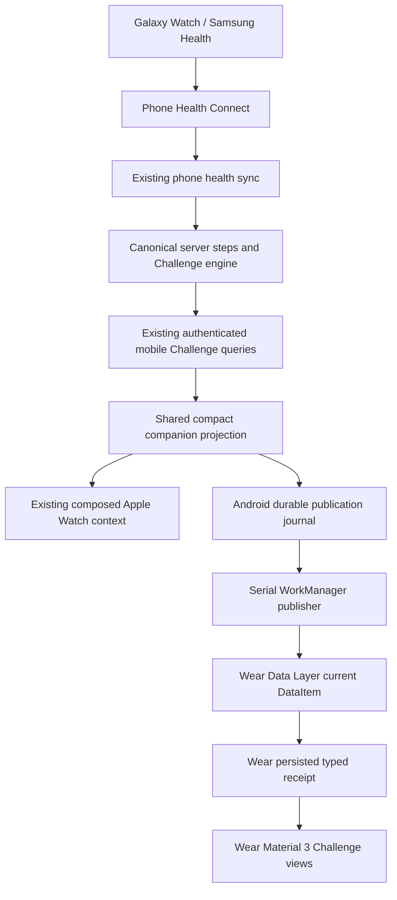

# Wear OS Challenges — Milestone 5

## Workout Time extension — Milestone 6

[WORKOUT_CHALLENGES.md](WORKOUT_CHALLENGES.md) documents the implemented second
metric, canonical session qualification, contract versions, metric-aware clients
and companion snapshot v1/v2 transition. Steps behavior and privacy/transport
boundaries below remain intact. Native device acceptance remains outstanding.

SparkyRivals has a read-only, non-standalone Android/Wear OS Challenge companion.
It displays server results relayed by the Android phone. It does not authenticate
to the server, read health sensors, ingest health data or calculate competition
results. No Challenge mutations, workout logging/scoring, Tile, complication,
notification, store publication or deployment is included.

## Integration base

Fork PR #5 merged normally at `e52c89b1314927309d42a351da8f509f44970ec5`.
The upstream fetch still resolved to `3c031663763fb5c6aedef7952b0163ef7cb5ef28`:
no new sync PR was necessary. That main is 37 commits ahead and zero behind the
frozen upstream snapshot. Work is on `milestone/wear-os-challenges`.
Upstream remains read-only, with its local push URL disabled. Actions remains
repository-wide disabled. Apple Watch source is preserved; its outstanding
Xcode/simulator/device acceptance from Milestone 4 is still outstanding.

## Architecture and maintained sources



The Samsung Health handoff is external to this codebase. Wear adds no Health
Services, Health Connect, body sensor, activity-recognition, heart-rate or step
permission. `check_in_measurements.steps` remains canonical and server rank,
tie, lifecycle, gaps, progress, totals and coverage remain authoritative.

Paths below are relative to `SparkyFitnessMobile/`:

| Layer                       | Maintained source                                                          |
| --------------------------- | -------------------------------------------------------------------------- |
| Identity                    | `app.identifiers.js`, `eas.json`                                           |
| Generated project wiring    | `plugins/withWearOsCompanion.ts`, `plugins/withWearConnectivity.ts`        |
| Wear application            | `targets/wear/build.gradle.template`, `targets/wear/src/main/`             |
| Shared native protocol      | `targets/wear/protocol/com/sparkyrivals/companion/ChallengeProtocol.kt`    |
| Android phone native bridge | `modules/wear-connectivity/android/`, `modules/wear-connectivity/index.ts` |
| Shared projection/types     | `src/utils/companionChallenges.ts`, `src/types/companionChallenges.ts`     |
| Shared cache observer       | `src/hooks/useCompanionChallenges.ts`, `challengeQueryOptions.ts`          |
| Shared privacy barrier      | `src/services/companionChallengeSession.ts`                                |
| Android publication         | `src/hooks/useWearChallenges.ts`, `src/services/wearChallengePublisher.ts` |
| Native previews             | `targets/wear/src/debug/`                                                  |
| Native model tests          | `targets/wear/src/test/`, `scripts/test-wear-models.py`                    |

Apple's existing `watchChallenges` types/utilities/session imports remain thin
compatibility facades. `useWatchChallenges` supplies Apple pairing availability
to the shared observer. The Swift protocol and single composed
`updateApplicationContext` writer are unchanged. Wear has its own narrow Android
publisher; there is no generic RPC bridge or second Challenge API client.

## Prebuild, application identity and signing

Wear generation is explicitly enabled by `EXPO_WEAR_ENABLED=1`, set in the three
SparkyRivals build profiles. It requires `APP_IDENTITY=custom`; upstream mode
rejects the opt-in. Ordinary upstream prebuild generates neither the Wear module
nor the phone bridge. Changing mode requires **clean** prebuild.

The plugin copies `targets/wear/` into generated `android/wear/`, replaces its
Gradle identity/version template, generates its display-name resource, and adds
`:wear` to settings. It copies the native phone bridge and the same protocol source
into generated `android/app/src/main/java`, registers its React package and adds
its capability resource. Removing `android/` loses no maintained code.
The shared JSON test fixture is copied into generated Wear test resources only.

| Variant     | Phone applicationId                  | Wear applicationId                   |
| ----------- | ------------------------------------ | ------------------------------------ |
| Development | `com.imjstnick.sparkyrivals.dev`     | `com.imjstnick.sparkyrivals.dev`     |
| Preview     | `com.imjstnick.sparkyrivals.preview` | `com.imjstnick.sparkyrivals.preview` |
| Production  | `com.imjstnick.sparkyrivals`         | `com.imjstnick.sparkyrivals`         |

Wear's internal namespace `com.sparkyrivals.wear` is not its applicationId. The
manifest requires `android.hardware.type.watch`, sets
`com.google.android.wearable.standalone=false`, disables backup and registers the
Data Layer listener for the one protocol path. It declares no health/network
permission of its own.

[Google Data Layer](https://developer.android.com/training/wearables/data/overview)
requires matching package names and signing certificates. Wear Debug selects the
**phone's actual Debug signing configuration**, including the same generated
keystore file. Wear Release selects the **phone's actual final Release signing
configuration**, including owned EAS injection, with no independent Wear key
variables. The Gradle guard rejects mismatched application IDs, missing/unsigned
release configuration, debug identity, inspection mode and unallocated Wear codes.
`MYAPP_RELEASE_*` remains the existing local/CI credential interface.

`:wear:assembleDebug` / `:wear:assembleRelease` produce a separate native APK;
`:app:assembleDebug` does not build or embed the Wear APK. Wear has no React Native
runtime dependency. Its Gradle configuration evaluates the phone Android model to
share signing and identity, so generate/configure the normal monorepo first.
Android SDK/JDK and full Gradle execution remain native acceptance requirements.

### Version codes

With Wear enabled, allocate disjoint ranges within each variant's future Play
listing:

- Phone `EXPO_BUILD_NUMBER`: **1–999999999**, with existing release rules (>1).
- Wear `EXPO_WEAR_BUILD_NUMBER`: **1000000000–2100000000**.

Both are validated integers. Wear Release requires an explicitly supplied code;
Debug/config inspection defaults to 1000000001. Test prebuilds used phone 100 and
Wear 1000000100; these are not distributed allocations. Do not repeatedly publish
them. A final Gradle guard checks the phone version after EAS version injection.

Maintain a release ledger and increase each form-factor counter independently.
Before distribution, reconcile local/EAS/Play counters; never reuse a published
code or decrement it to recover a failed release. EAS continues owning its phone
counter. Wear's explicit counter is supplied separately. Separate APKs/AABs,
matching package/certificate, distinct codes, watch-only targeting and the same
future Play listing are intended; no Play Console configuration exists here.

Build-only variables are documented in the full environment reference and
`docker/.env.example` comments. They are excluded from server Compose, Helm,
EnvGenerator and the simple server template. No signing secret is read into Expo
runtime configuration.

## Data Layer protocol

The sole fixed path is **`/sparkyrivals/challenges/v1`**. No user/challenge identity
appears in the path. The DataItem contains UTF-8 JSON, decoded into Kotlin models:

```text
version: 1
publisherId: random UUID for this phone installation, persisted without backup
sequence: positive decimal-string 64-bit revision, persisted before publication
snapshot:
  version: 1
  accountKey: local server-config ID + authenticated profile ID (no URL/token)
  state: ready | unavailable
  generatedAt: oldest successful contributing query timestamp, epoch milliseconds
  items[]:
    id, name, lifecycle, membership
    startDate, endDate, timezone, totalDays, daysRemaining, currentDay?
    participantCount?, leadMargin?
    rows[]:
      id, name, isSelf, total, rank?, tied, leader, gapToLeader?
      today?: {date, value, present, eligible}
      daysWithSteps, eligibleDays
  hasMore
```

Kotlin serialization here is an explicit typed `JSONObject` adapter, not Java
serialization. It validates versions, bounded arrays/names, numeric types,
calendar dates, IANA zones and progress/capacity bounds. Unknown object keys are
ignored; unsupported schema versions and malformed state clear the UI safely.
The optional `calculatedAt` from the shared Apple projection is unnecessary on
Wear and omitted by its native serializer. No daily history or raw health samples
are sent. Sequence ordering never depends on a wall clock or an in-memory counter.

### Bounds and consent

Both companions reuse the same selection: at most **8** relevant Challenges,
prioritizing pending invitations, active accepted, upcoming accepted, and at most
**2** recent completed. Cancelled/left/declined entries are omitted. Leaderboard
rows are server-ranked top **3 plus self**, at most 4, without reranking. 1v1
includes both. Names are capped at 100 Unicode code points on the phone.

Pending membership requests no leaderboard and carries no roster/scores. The
native decoder also strips rows for pending/upcoming entries. Self/rank/tie/gap,
daily presence and reconciled totals are preserved. Missing is never promoted to
confirmed zero. Selection considers loaded shared list pages (initially 20),
not an unlimited background history crawl; `hasMore` covers omitted/unloaded items.

The Unicode-heavy 8×4 transport fixture is **25,876 UTF-8 bytes** before native
omission of unused fields, below the 32 KiB snapshot budget and native 40 KiB
wire guard. Google's [DataItem limit](https://developer.android.com/training/wearables/data/data-items)
is 100 KB. No Asset transport or large-payload workaround is needed.

## Publication, privacy and ordering

The headless hook is mounted beside the existing Apple bridge in the app shell.
It observes existing actor-scoped query options and shares fresh screen caches.
Mutation/health invalidation, successful query changes and foreground refresh feed
it. Refresh is throttled to 30 seconds, with no Watch-specific polling.

JS deduplicates stable serialized snapshots and checks session revision and active
configuration immediately before native dispatch. The synchronous auth barrier
queues an explicit empty `unavailable` tombstone at logout, account/server switch,
auth loss and initial identity verification. This works without an HTTP request.
An old pending identity/configuration read cannot publish old-account results.
Native enqueue failure reports a warning and retries on later state/foreground;
it never mutates the Challenge query cache.

Native phone storage atomically persists the publisher UUID, sequence and latest
snapshot in `noBackupFilesDir`. A unique serial WorkManager chain retries failed
Data Layer writes with exponential backoff. It has no Internet connectivity
constraint because Bluetooth delivery is sufficient. Workers read the latest
journal; a comparison against the current local DataItem avoids repeated identical
writes, including after process restart. Privacy clears are marked urgent.
The JS promise acknowledges durable local enqueue, **not receipt by the watch**.

Wear's persisted receipt retains source node, publisher UUID and highest sequence,
even for a tombstone. It rejects duplicates/older revisions across restarts. New
account state replaces the previous snapshot entirely. An open detail resolves
its ID from current state; navigation resets when account identity clears/changes.

A new phone installation/publisher UUID or another source node clears the UI and
requires explicit Wear app-storage reset before rebinding. This deliberately
avoids guessing an ordering across unrelated installations. Unsupported/malformed
native state also clears and requests compatible apps/reset. Do not silently
restore backed-up journals or treat an unknown publisher as newer. Android
app updates preserve the journal; uninstall/data-clear is a different installation.

An unreachable watch cannot be remotely erased instantly. The tombstone is
persisted/queued and supersedes old state when delivery becomes possible. Cold
phone startup without verifiable auth clears for privacy; ordinary transient
network failure for a verified same-account cache retains its last valid values.

## Native presentation

Wear Material 3 `AppScaffold` / `ScreenScaffold`, `TransformingLazyColumn` and
swipe-dismiss navigation provide round-screen padding, rotary scrolling defaults,
time and scroll indicator. Standard buttons expose tap roles; headings and grouped
rank/score text expose TalkBack semantics. Text scales and scrolls; meaning never
relies on color alone. There are no custom haptics or animation framework.

- One item without `hasMore` opens directly; otherwise show a compact relevant
  list. Selecting an item opens current detail; swipe/back returns normally.
- **1v1:** own score first, large own/opponent totals, rank, server lead/gap/tie,
  today's provided values, date/status and inclusive days remaining.
- **Groups:** original transmitted ranks (including self outside the top three),
  names/totals/ties and full participant count. Never rerank the truncated set.
- **Invitations:** rules/dates and Accept on phone or Review on phone after close;
  no scores and no mutation. **Upcoming:** start, rules and authorized participant
  count with no fake competition zeros. **Completed:** current reconciled leaders
  and correction note, without a separately persisted winner.
- **Empty:** creation hint, distinct from not-yet-synced. `hasMore` remains visible.
  CapabilityClient checks the phone capability at foreground refresh; unreachable
  or absent app says companion unavailable rather than claiming an empty account.
  It cannot distinguish every pairing/installation problem. Cached valid results
  remain readable regardless of current reachability.
- Explicit zero says **0 steps**; absent canonical data says **No step data**.
  Coverage warns about missing days without claiming synchronization completeness.

The source timestamp, not transmission time, drives Updated and the **15-minute**
stale label. A minute timer only updates age/date labels, never lifecycle or score.
A source clock more than five minutes ahead is also marked stale. A stored daily
point is labelled Today only on that day in the Challenge's timezone.
Numbers/dates use Android/device locale. English Android resources are canonical;
future translations can add locale resources without changing the protocol.

## Dependencies

No React Native/Expo dependency was upgraded and no JavaScript dependency added.
Native dependencies are isolated to the opted-in Wear/phone integrations:

| Dependency                                   | Version / reason                                                                       |
| -------------------------------------------- | -------------------------------------------------------------------------------------- |
| Kotlin / Compose compiler                    | Inherit existing **2.1.20** from phone/RN toolchain                                    |
| Wear Compose material3/foundation/navigation | **1.5.0**, stable Wear Material 3 APIs compatible with the existing compiler           |
| Activity Compose                             | **1.10.1**, native activity                                                            |
| Lifecycle runtime Compose                    | **2.9.1**, lifecycle-aware state collection                                            |
| Play Services Wearable                       | **20.0.1**, Data Layer/capabilities on both sides; includes Google's 2026 security fix |
| WorkManager work-runtime                     | **2.10.1**, phone-only durable retry                                                   |
| Compose ui-tooling / Wear compose-ui-tooling | **1.8.3 / 1.5.0**, debug previews only                                                 |
| JUnit / org.json                             | **4.13.2 / 20250517**, JVM tests only                                                  |

[Wear Material 3](https://developer.android.com/jetpack/androidx/releases/wear-compose-m3)
replaces the old Wear material library; generic phone Material is not the Wear UI
foundation. [Play Services release notes](https://developers.google.com/android/guides/releases)
record Wearable 20.0.1. Downloaded AAR metadata requires compileSdk ≥35 and AGP ≥8.6
for Wear Material 3; this fits the inherited project versions. This inspection
is not a substitute for compiling the complete generated project.

## Build and test commands

From `SparkyFitnessMobile/`, after the normal frozen workspace install:

```sh
pnpm run validate
pnpm run test:ci --watchman=false
python3 scripts/test-wear-models.py --download
APP_CONFIG_ONLY=1 EXPO_BUILD_NUMBER=100 EXPO_WEAR_BUILD_NUMBER=1000000100 \
  pnpm build:profile sparkyrivals-development \
  pnpm exec expo prebuild --clean --platform android --no-install
APP_CONFIG_ONLY=1 EXPO_BUILD_NUMBER=100 EXPO_WEAR_BUILD_NUMBER=1000000100 \
  pnpm build:profile sparkyrivals-development \
  pnpm validate:native --platform android --snapshot /tmp/wear-native.json
# Repeat clean prebuild, then use --compare /tmp/wear-native.json.
```

Repeat with preview and production profiles. Upstream/default must omit Wear.
The native validator asserts identity, manifest, module registration, disjoint
versions, signing guards, native dependencies and generated/tracked source parity.
The model script uses a disposable checksum-pinned Maven compiler/JUnit cache,
compiles the actual Kotlin protocol and runs the same tests as `:wear:testDebugUnitTest`.
`--download` opts into fetching dependencies; no system SDK/JDK is installed.
The shared phone JSON fixture is also consumed by Kotlin and Apple contract tests.

With a working Android SDK/JDK 17, prebuild then run:

```sh
cd android
./gradlew :wear:testDebugUnitTest :wear:assembleDebug :app:assembleDebug
```

Use Android Studio previews under the generated Wear Debug source set:
Versus, Group, Invitation, Upcoming, Completed, Empty, Stale, Multiple, Tie,
Uninitialized; device and font-scale annotations cover small/large round displays.
Samples are only in `src/debug`, never a runtime mock mode. No emulator screenshot
or Compose instrumentation result is claimed here.

### Linux validation record — 2026-10-03

| Check                                                              | Result                                                                      |
| ------------------------------------------------------------------ | --------------------------------------------------------------------------- |
| Mobile `pnpm run validate`                                         | Pass: generation, typecheck, lint, i18n, Knip, native locale and formatting |
| Full mobile `pnpm run test:ci --watchman=false`                    | **498 suites / 7,677 tests passed**, no failed/skipped tests                |
| Focused Wear build/bridge/publisher/source contracts               | **4 suites / 35 tests passed**                                              |
| Actual Kotlin protocol compilation + JUnit                         | **21 tests passed** using a disposable pinned compiler on installed JDK 27  |
| Owned development/preview/production Android clean prebuilds       | Each passed twice; repeated native metadata matched                         |
| Upstream/default Android prebuild + native validator               | Pass; no Wear module/bridge present                                         |
| Clean development Android + iOS prebuild, combined validator       | Pass; all five Apple identities/groups preserved                            |
| Workflow safety / PR validation scripts                            | **14 tests passed**; Actions remains disabled                               |
| Docs production build, changed-doc formatting/local links          | Pass; 58 local Markdown destinations checked, none missing                  |
| `git diff --check`                                                 | Pass                                                                        |
| Android app/Compose/Gradle APK compilation                         | **Not run**: Android SDK/JDK 17 unavailable                                 |
| Emulator, Compose instrumentation, visual or physical Galaxy Watch | **Not run**                                                                 |

Android semantic hashes (each matched across two clean prebuilds):

- Development: `da42cae34e7d5d942f04e610feb20b28553906c172f36d2e9799175ebefa5566`
- Preview: `371f366b532e5a937f3c436523dd82442c83134a27fdc207a4f2e2b10431523e`
- Production: `6380d966389fba4be56fad0f2aa4d0befca898feb485fb99242c4f9555034674`

The full suite adds 35 tests over the merged Apple Watch baseline. Existing Apple
composition, own-workout marker/dedupe, identity/signing, auth and health sync tests
remain green. No server/shared/web source changed. The expected missing Apple-team
prebuild warning, pre-existing React `act(...)` test warnings, docs chunk-size
advisory and compiler-on-JDK-27 deprecation warnings are not suppressed. No unrelated
Expo patch alignment was performed.

The host has JDK 27/8 but no configured Android SDK, adb, emulator or required
JDK 17. Only the isolated protocol JVM compilation ran. Neither
`:wear:assembleDebug` nor `:app:assembleDebug` was run. Compose/Android services,
Gradle signing execution, simulator visuals, TalkBack and physical Data Layer
acceptance remain outstanding. No permanent key, credential, cloud build,
store submission, Actions enablement or workflow dispatch occurred.

## Physical Galaxy Watch acceptance checklist

This is a future checklist, **not an executed test record**:

1. Generate the same variant for phone and Wear; inspect both final manifests.
   Use `apksigner verify --print-certs` on both APKs and compare the SHA-256 signer
   certificate digest. Repeat for owned releases after key custody is established.
2. Install phone APK and separate Wear APK on a paired Android/Galaxy Watch.
   Confirm the normal Samsung Health → Health Connect phone sync remains intact.
3. Open/sign into the phone; verify actual server Challenge results first, then
   Data Layer delivery to Wear without any Watch health/server-auth permission.
4. Inspect active 1v1, ties, rank-7 self in a large group, multiple Challenges,
   pending invitation without scores, upcoming, completed and empty states.
5. Verify explicit zero vs absent data, 15-minute stale label, clock skew and
   offline cached state. Reconnect and confirm a lower canonical correction
   replaces the old total, including a completed result.
6. Logout/switch account/server while online and offline. Verify queued clear,
   no retained old detail, then only the new account's state. Exercise rapid
   switching and process termination between journal save and delivery.
7. Restart/update both apps; old/lower sequences must not restore prior state.
   Reinstall the phone: Wear must clear and request reset, then clear Wear app
   storage and sync the current DataItem to deliberately bind the new install.
8. Test small/large round devices, large fonts, TalkBack rank/score/status labels,
   touch targets, rotary scrolling and swipe/back behavior.
9. For release acceptance, prove missing credentials/config-only/unallocated
   numbers fail and both signed artifacts share the owned certificate. Back up
   permanent key custody separately; this milestone did not create that key.

## Boundaries and future work

No Wear-specific server endpoint, database/RLS/scoring change, Challenge write
transport, workout feature, Tile, complication, notification or phone UI redesign
was needed. A later Tile/complication should consume the same receipt with the
same account and freshness rules. Any future mutation transport needs its own
consent, durable idempotency and acknowledgement design. Production remains on a
separate server checkout with bind-mounted `dockerdata/`; Wear introduces no
Docker state or deployment change.
